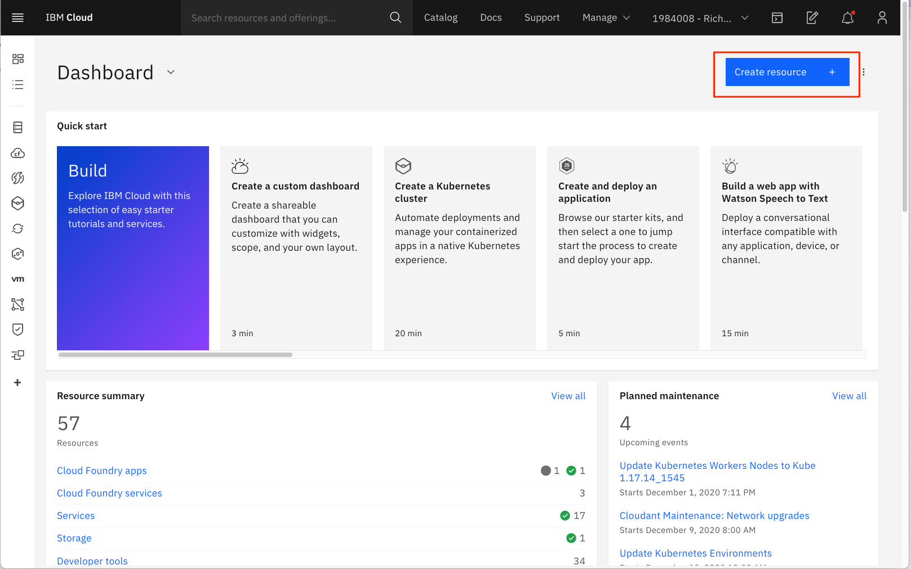
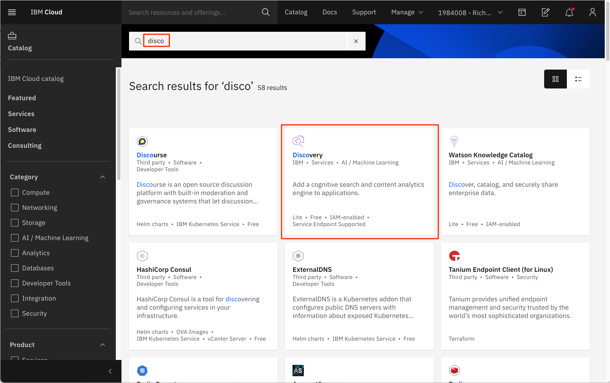
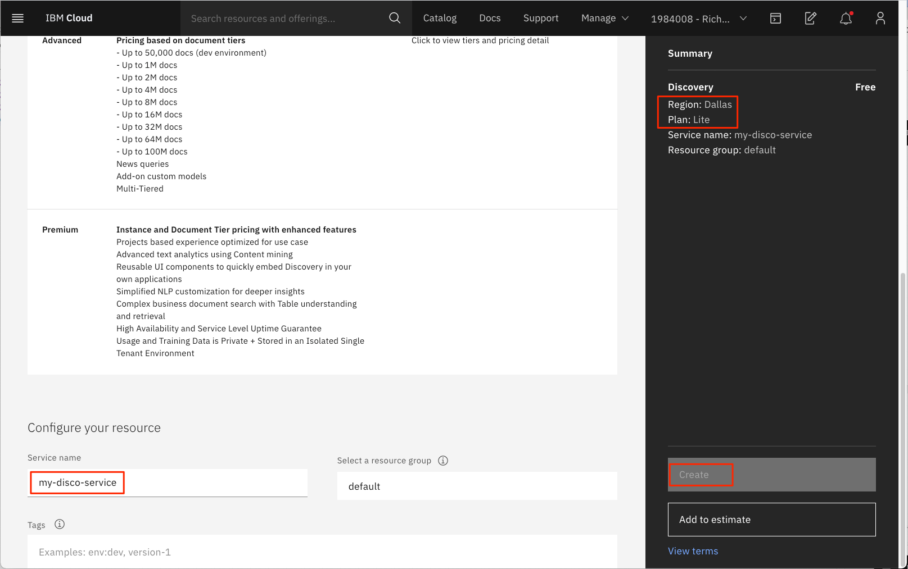
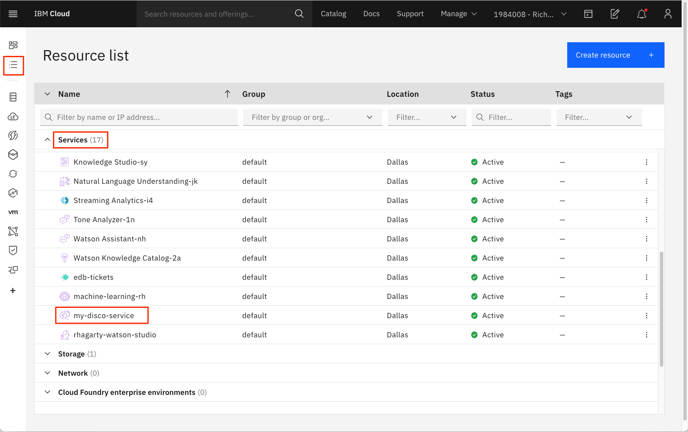
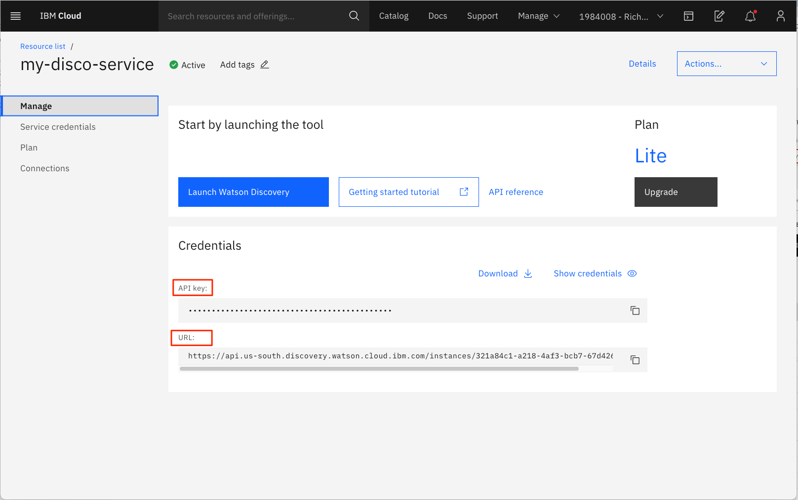
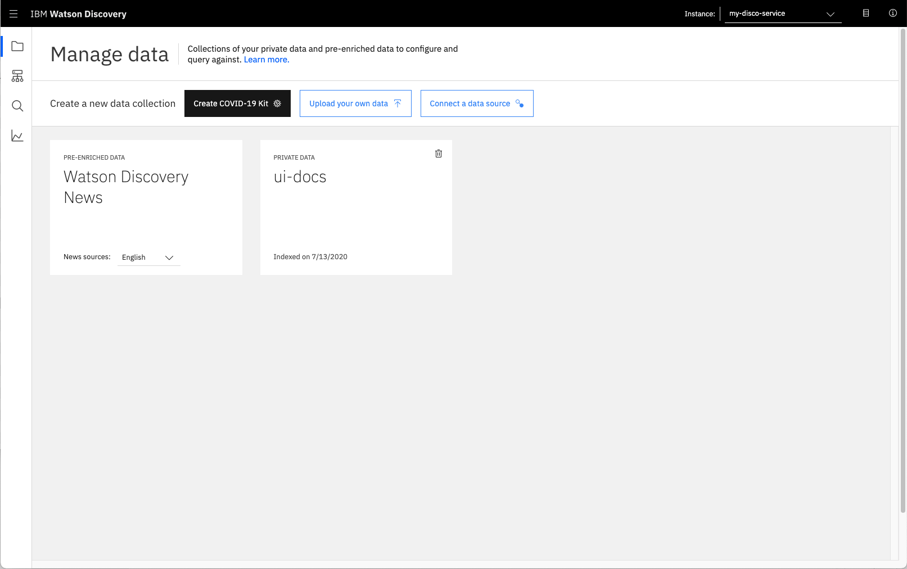
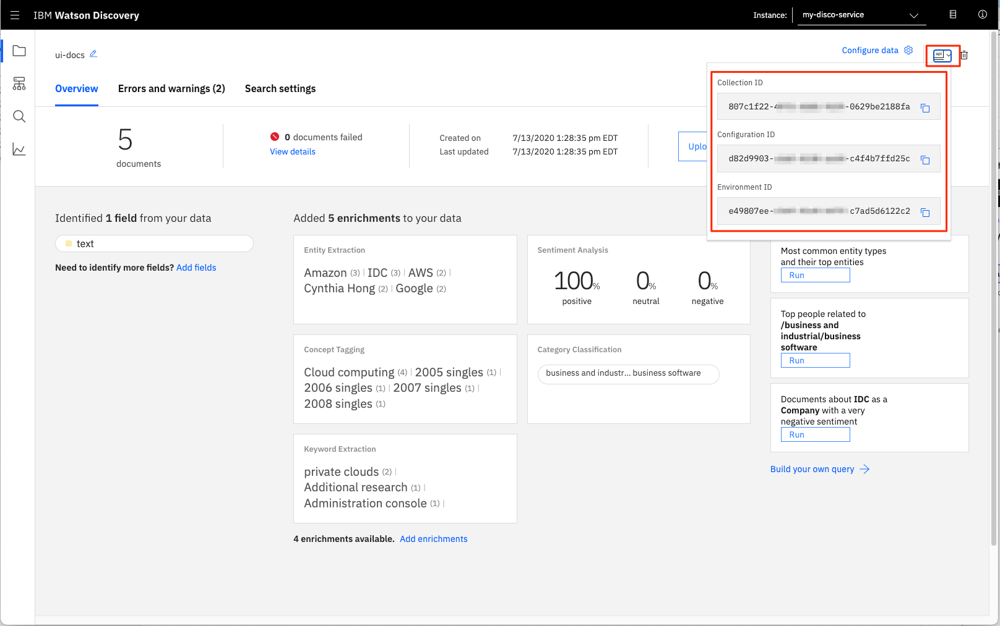

# How to provision and configure Watson Discovery on IBM Cloud

## Create a Watson Discovery service instance

From the IBM Cloud dashboard, click on the `Create service +` button.

  

From the service list panel, use the search option to find the Watson Discovery service tile, and click on it.

  

From the Watson Discovery create instance panel, select what region to deploy your instance, and select the `Lite` plan. Then enter a unique service name and hit the `Create` button.

  

## Get Watson Discovery service credentials

Once created, the new Discovery service will be listed in the `Resource List` panel, in the `Services` section.

  

Click on the service name to bring up the service panel.

  

**IMPORTANT**: Take note of the `Credentials` values. They will be required if you want to access the service using the API. If you need to create a new set of credentials, click on the `Service Credentials` tab option.

## Launch the Watson Discovery service

Click the `Launch Watson Discovery` button to navigate to your service.

  

### Collect Watson Discovery configuration data

The Watson Discovery service allows you to create `Collections` of data. Once created, you will need to know the `Environment`, `Configuration` and `Collection` IDs to access your service using the API. To find these values, simply open up your collection, and click the `API` button.

  
